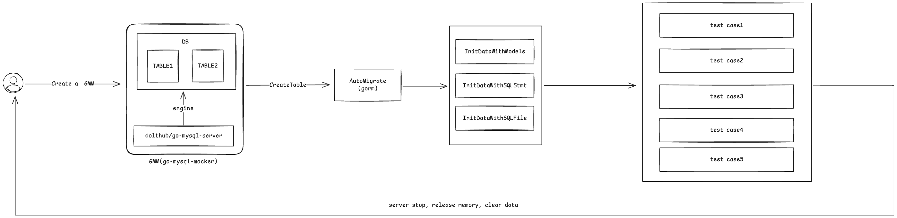

# go-mysql-mocker(gmm)

[](https://goreportcard.com/report/github.com/hedon954/go-mysql-mocker)
[](https://codecov.io/gh/hedon954/go-mysql-mocker)
[](https://github.com/hedon954/go-mysql-mocker/actions)
[](https://github.com/hedon954/go-mysql-mocker/releases)
[](https://pkg.go.dev/github.com/hedon954/go-mysql-mocker)


`go-mysql-mocker(gmm)` was created to provide developers with a reliable and straightforward tool for mocking MySQL interactions in Go applications, particularly for automated testing environments. By simulating a MySQL server, `go-mysql-mocker` allows developers to conduct unit tests without the overhead of setting up a real database, thus speeding up test cycles and reducing external dependencies. This is especially useful in continuous integration (CI) environments where test reliability and speed are paramount.



## Dependencies

- [go-mysql-server](https://github.com/dolthub/go-mysql-server): used for MySQL memory server
- [gorm](https://github.com/go-gorm/gorm): used for creating table and initializing data

## Features

- Easy setup and integration with Go projects.
- Uses in-memory storage to speed up tests.
- Automatic table creation and data seeding using GORM models or SQL statements.

## Requirements

- Go 1.20 (or later versions)

## Installation

```bash
go get -u github.com/hedon954/go-mysql-mocker
```

## Usage

- `Port(port int)`: Sets the MySQL server port to the specified value. This method allows you to customize the port on which the MySQL server listens.
- `CreateTable(model)`: Creates a database table based on the schema defined in the provided model. This method facilitates the automatic creation of tables directly from GORM models.
- `InitData(data)`: Populates the database with test data using instances of Go structs. This method supports initializing data from single instances or slices of instances that implement the schema.Tabler interface.
- `SQLStmts(stmts)`: Executes the provided SQL statements to generate test data. This method allows for direct insertion or modification of data using raw SQL commands.
- `SQLFiles(files)`: Reads SQL statements from specified files and executes them to generate test data. This method is useful for initializing the database with a larger set of pre-defined SQL operations.
- `Build()`: Initializes and starts the MySQL server with all specified configurations and initializes the data. This method must be called to execute the configurations set up by the preceding methods.


## Quick Start

### prepare a data model and implement `TableName()` interface
```go
type UserState struct {
	UID   string `gorm:"primaryKey;column:uid"`
	State string `gorm:"column:state"`
}

func (u UserState) TableName() string {
	return "user_state"
}
```

### write a business logic
```go
func ChangeUserStateToMatch(db *sql.DB, uid string) (int64, error) {
	res, err := db.Exec("UPDATE user_state SET state = 'match' WHERE uid = ?", uid)
	if err != nil {
		return 0, err
	}
	return res.RowsAffected()
}
```

### use `gmm` to test it
```go
func TestChangeUserStateToMatch(t *testing.T) {
	t.Run("no data should have no affect row", func(t *testing.T) {
		db, _, shutdown, err := gmm.Builder("db-name").Port(20201).CreateTable(UserState{}).Build()
		assert.Nil(t, err)
		defer shutdown()
		res, err := ChangeUserStateToMatch(db, "1")
		assert.Nil(t, err)
		assert.Equal(t, int64(0), res)
	})

	t.Run("has uid 1 should affect 1 row and change state to `match`", func(t *testing.T) {
		// prepare db and init data
		origin := UserState{State: "no-match", UID: "1"}
		db, gDB, shutdown, err := gmm.Builder().CreateTable(UserState{}).InitData(&origin).Build()
		assert.Nil(t, err)
		defer shutdown()

		// check before change state
		var before = UserState{}
		assert.Nil(t, gDB.Select("uid", "state").Where("uid=?", "1").Find(&before).Error)
		assert.Equal(t, origin, before)

		// run biz logic
		res, err := ChangeUserStateToMatch(db, "1")
		assert.Nil(t, err)
		assert.Equal(t, int64(1), res)

		// check after change state
		var after = UserState{}
		assert.Nil(t, gDB.Select("uid", "state").Where("uid=?", "1").Find(&after).Error)
		assert.Equal(t, UserState{
			UID:   "1",
			State: "match",
		}, after)
	})
}
```

For more detail, please see [examples](./examples) folder.
